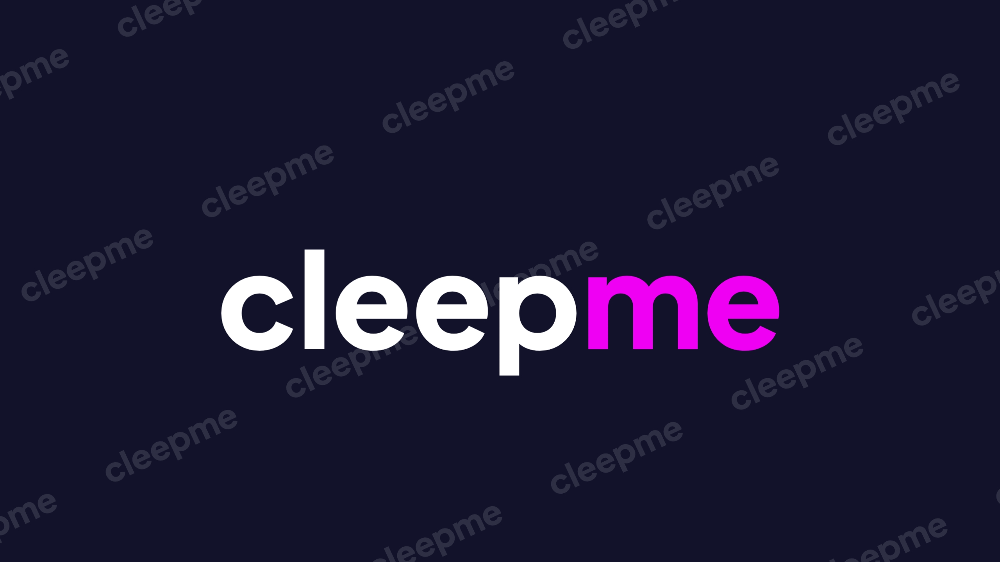

# cleepme — Automatic Video Clipper (100% Client-Side)

  

**cleepme** is a web-based, automatic video clipper that analyzes long video files and extracts interesting moments into ready-to-use clips—running **entirely in the browser without any backend**. 

No servers, no databases, no cloud storage, and no APIs. Your videos never leave your device.

---

## ⚡ Core Philosophy & Architecture

Unlike traditional video editors that rely on manual timeline trimming, **cleepme** focuses on automation: **Drop a video → Analyze → Export multiple clips**. 

- **100% Zero-Backend:** All processing happens locally via client-side JavaScript.
- **Privacy-First:** Zero tracking, zero uploads, no authentication, and no data retention.
- **Standalone Identity:** Designed from scratch with a flat, modern visual aesthetic.

---

## 🎨 Brand & Visual Identity

The interface avoids generic AI-dashboard templates and stock imagery, leaning heavily into a clean, futuristic, yet minimalist visual language:
- **Color Palette:** Dominated by flat **Magenta** and **Purple**, balanced with solid **White** and **Dark Neutrals**.
- **No Gradients:** Strictly flat design across backgrounds, buttons, text, cards, borders, and decorations.
- **Layout:** Generous whitespace, bold modern typography, and structured rounded corners (no excessive pill/badge shapes).
- **Hero Cleanliness:** Zero badges or micro-capsules cluttering the main headings.

---

## ✨ Features

### 🔍 Smart Detection & Local Processing
Analyzes video structures locally without faking AI scores or cloud computation. The browser scans the file using available native signals:
- **Scene Changes:** Identifies abrupt visual shifts and color transformations.
- **Audio Activity:** Flags volume spikes, sudden noise variations, or dramatic pauses.
- **High-Activity Zones:** Detects rapid visual movement and pixel-delta changes.
- **Structural Rules:** Respects user-defined minimum/maximum durations and filters out empty dead spaces.

### 🎬 Automatic Multi-Clipping
Processes a single long-form video file and generates a structured batch of multiple video clips simultaneously.

### 🛠️ Configurable Settings
Fine-tune the local extraction engine before launching the analysis process:
- **Clip Length:** Presets for *Short*, *Medium*, *Long*, or precise custom durations.
- **Clip Budget:** Set the exact number of maximum clips you want to extract.
- **Detection Sensitivity:** Adjust threshold levels (*Low*, *Medium*, *High*) to dictate how aggressively visual and audio shifts trigger a new clip boundary.
- **Signal Toggles:** Independently enable or disable *Scene Detection* and *Audio Activity* analysis.

---

## 🗺️ Product Journey & Workflow

### 1. Landing Page & Tool Access
Minimalist navigation header (**cleepme** Wordmark, Features, How It Works, Privacy, and a prominent **Try cleepme** CTA) leading to a focused Hero section:
> **Heading:** Turn long videos into clips automatically.
> **Subheading:** cleepme finds interesting moments in your video and turns them into ready-to-use clips, directly in your browser.

### 2. Auto Clipper Tool (Initial State)
A dedicated, distraction-free drop zone supporting Drag & Drop and standard File Pickers, explicitly reminding users that *"Your video stays on your device"*.

### 3. Verification & Analysis State
A transparent, non-faked progress tracker communicating actual client-side browser workloads:
- `Scanning scenes...`
- `Detecting activity...`
- `Finding potential clips...`
- `Building clip candidates...`

### 4. Dashboard & Result Interface
Displays the **Original Video Preview** side-by-side with a grid of **Detected Clips** rendered as standalone cards. Every card features:
- Actual frame thumbnail, clip index number, precise timestamps, and real durations.
- Individual **Preview** and **Download** tools.
- **Adjust Clip Option:** A manual override interface providing fine control over start and end points if the automated markers need refinement.

---

## 🛠️ Technical Stack & Implementation

To optimize client-side resources and prevent the browser UI thread from freezing during deep pixel analysis, the repository implements:
- **HTML5 Video & Canvas API:** For localized video metadata reading and rapid sequential frame scanning.
- **Web Workers:** Offloads heavy mathematical frame-differentiation and audio-buffer analysis routines away from the main thread.
- **FFmpeg.wasm / Client-Side Codec Libraries:** Handles exact millisecond trimming and native file exports entirely within the user's sandbox ecosystem.

### Robust Client Error Handling
The application treats local resource limitations transparently, catching and reporting human-readable alerts for:
- Invalid or corrupted video container formats.
- Codec constraints and lack of browser hardware acceleration.
- Out-of-memory (OOM) instances caused by exceptionally massive files.
- Missing or broken video metadata tracks.

---

## 📱 Responsiveness

The user interface follows a strict responsive layout. On mobile screens, the architecture refactors gracefully to keep the vital application loop functional: the live video preview, clip grids, time markers, and download actions remain easily tappable and perfectly visible without scaling artifacts.
